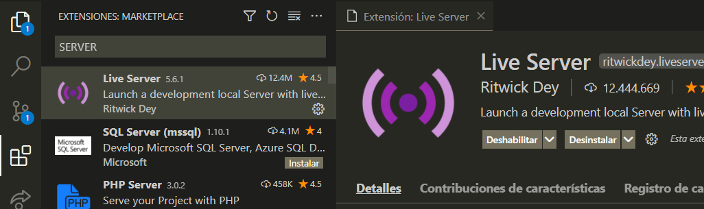
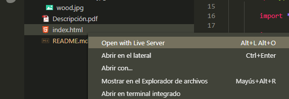
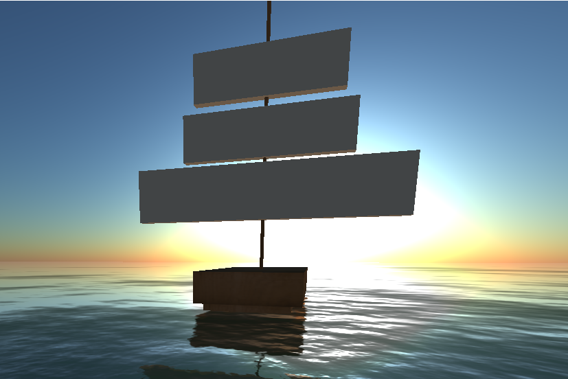

# GraficasComputacionales
- Néstor Martínez
- Alan Zavala
- Rubén Salazar

# Pasos para visualizar el proyecto

1) Tener VSCODE instalado. 
2) Abrir la carpeta con VSCODE. 
3) Instalar la extensión de Live Server y habilitarla.

4) Abrir el archivo por medio de liveServer

5) Se abrirá una pestaña en su navegador predeterminado con el proyecto. 

# Proyecto
En el proyecto consiste en la animación de un barco flotando.

De igual manera, tiene control interactivo con las teclas WASD y flechas para dar la sensación de control de movimiento.